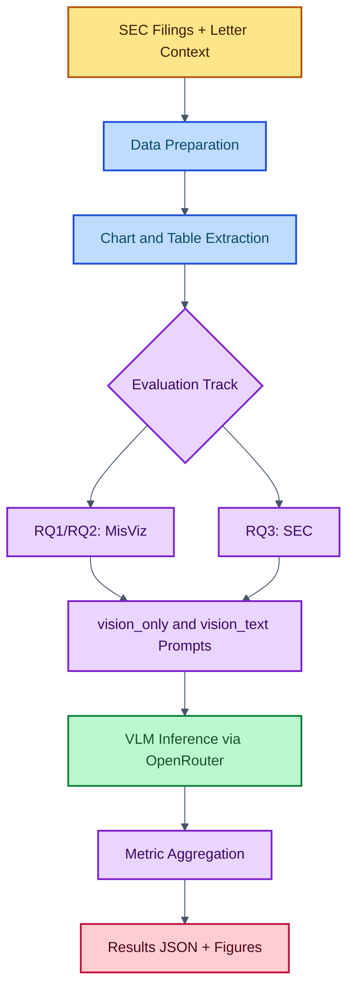

# FinChartAudit

[](https://github.com/PCBZ/FinChartAudit/actions/workflows/ci.yml)
[](https://www.python.org/)
[](https://openrouter.ai/)
[](https://pytorch.org/)
[](https://fastapi.tiangolo.com/)
[](https://playwright.dev/)
[](https://scikit-learn.org/)
[](LICENSE)

Detecting misleading charts in SEC financial filings with Vision-Language Models.

## Setup

```bash
python -m venv .venv
source .venv/bin/activate
pip install -r requirements.txt
pip install -e .
playwright install
```

Copy `.env.example` to `.env` and fill in your values:
```bash
cp .env.example .env
```

## Usage

### Core Pipeline

```bash
python src/run_pipeline.py           # Full evaluation pipeline
python src/sec_pipeline.py           # SEC-specific evaluation
python src/visualization.py          # Generate result figures
```

## System Overview

FinChartAudit evaluates whether multimodal models can detect misleading financial visuals and SEC Non-GAAP prominence issues.



## Data Card

- **MisViz (RQ1/RQ2)**: misleading chart benchmark with image-level annotations.
  - Labels: misleading / non-misleading + misleader types.
  - Data refs: [data/misviz/misviz.json](data/misviz/misviz.json), [data/charts](data/charts)

- **SEC corpus (RQ3)**: filing visuals and tables paired with SEC comment-letter context for Non-GAAP/compliance checks.
  - Data refs: [data/sec](data/sec), [data/charts](data/charts), [data/tables](data/tables), [data/letters](data/letters), [data/ground_truth.json](data/ground_truth.json)

- **Current evaluation coverage**
  - MisViz: `271` charts
  - SEC: `96` items across `10` tickers in aggregate output
  - Metrics source: [results/aggregated_summary.json](results/aggregated_summary.json)

## Model and Prompting

### Models

- `claude` → `anthropic/claude-haiku-4.5`
- `qwen` → `qwen/qwen3-vl-8b-instruct`

Configured in [src/config.py](src/config.py), called via OpenRouter in [src/vlm/openrouter_client.py](src/vlm/openrouter_client.py).

### Conditions

- **vision_only**: model sees only the image.
- **vision_text**: model sees the image plus structured text context (ground-truth data for MisViz or SEC context for RQ3).

### Prompt design

- Uses an explicit misleader taxonomy block and few-shot examples.
- Enforces strict JSON-only responses for stable parsing.
- SEC prompts separate chart and table logic, with Non-GAAP prominence rules based on SEC guidance.

Prompt builders are in [src/prompts.py](src/prompts.py):

- `build_vision_only_prompt`
- `build_vision_text_prompt`
- `build_chart_prompt`
- `build_table_prompt`
- `build_rq3_prompt`

## Results Summary

Primary aggregated metrics are saved in [results/aggregated_summary.json](results/aggregated_summary.json).

### RQ1/RQ2 (MisViz, 271 charts)

| Model | Condition | Accuracy | Precision | Recall | F1 |
|---|---|---:|---:|---:|---:|
| Claude | vision_only | 0.771 | 0.782 | 0.883 | **0.830** |
| Claude | vision_text | **0.779** | 0.832 | 0.813 | 0.822 |
| Qwen | vision_only | 0.672 | 0.773 | 0.678 | 0.723 |
| Qwen | vision_text | 0.664 | **0.845** | 0.573 | 0.683 |

### RQ3 (SEC, 96 items)

| Model | Condition | Accuracy | Precision | Recall | F1 |
|---|---|---:|---:|---:|---:|
| Claude | vision_only | 0.375 | 1.000 | 0.375 | 0.545 |
| Claude | vision_text | **0.396** | 1.000 | **0.396** | **0.567** |
| Qwen | vision_only | 0.167 | 1.000 | 0.167 | 0.286 |
| Qwen | vision_text | 0.073 | 1.000 | 0.073 | 0.136 |

### Quick takeaways

- Claude variants are stronger overall than Qwen on both MisViz and SEC tasks.
- On MisViz, `vision_text` slightly improves Claude accuracy, while `vision_only` gives Claude the best F1.
- On SEC, all models have high precision but low recall, indicating conservative flagging behavior (few false positives, many misses).

## License

MIT
